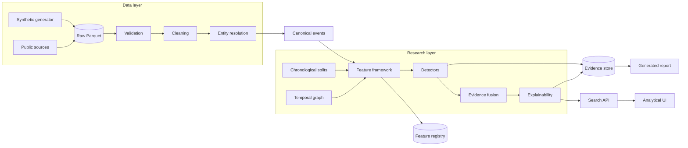

# MOSAIC

**Multi-Source Analytics, Signal & Intelligence Core**

A research-grade Data Science platform for integrating large heterogeneous event
datasets and detecting temporal, relational, and behavioral anomalies using
statistical methods, graph analysis, and machine learning.

> **Status: under construction.** Milestones 1-5 are implemented and tested.
> Detectors, fusion, the search API, the frontend and the research report are not
> yet built. See *Status* below for what has actually been executed.

## Research question

How effectively can heterogeneous multi-source event data be integrated into a
unified analytical representation for detecting meaningful temporal, relational,
and behavioral anomalies while controlling false positives and preserving rigorous
out-of-time evaluation?

## Architecture



## Status

Verified by execution on the `world_a` synthetic world (497,994 cleaned events,
1,017 resolved entities, 4 sources):

| Component | State | Evidence |
|---|---|---|
| Synthetic generator (4 incompatible schemas, 10 anomaly families) | implemented | written + run |
| Ingestion, manifests, validation | implemented | 0 FAIL, quality 0.95 |
| Cleaning with drop ledger | implemented | deterministic, counted |
| Entity resolution (5 blocking strategies, 6 matchers) | implemented | P=0.996, R=0.997 |
| Chronological splits + leakage guards | implemented | boundary tests pass |
| Feature framework (6 families) | implemented | 1.2s / 498k rows, `assert_causal` passes |
| Temporal graph features | **not implemented** | - |
| Detectors, fusion, calibration | **not implemented** | - |
| Search API, frontend | **not implemented** | - |

## Installation

```bash
git clone https://github.com/TMStroo/MOSAIC.git
cd MOSAIC
python -m venv .venv && . .venv/Scripts/activate    # Windows
# python3.12 -m venv .venv && source .venv/bin/activate   # Linux/macOS
pip install -e .
```

## Reproducing what exists today

```bash
python -m mosaic data generate --profile world_a   # synthetic benchmark + truth sidecar
python -m mosaic ingest --dataset world_a
python -m mosaic validate --dataset world_a
python -m mosaic clean --dataset world_a
python -m mosaic resolve --dataset world_a
```

Development smoke tests:

```bash
python scratch/build_resolved.py --force    # cached resolved event stream
python scratch/smoke_features.py             # feature pipeline + causal assertions
pytest tests/ -q                             # unit, integration and leakage tests
```

## How this differs from the author's other projects

- **DriftGuard** - cybersecurity, distribution shift, temporal ML evaluation.
- **ORION** - mathematical optimization, scheduling, operations research.
- **MOSAIC** - multi-source data integration, data engineering, entity
  resolution, temporal and graph analysis, statistical modeling, and a searchable
  analytical layer. It complements those two rather than overlapping them.

## License

See `LICENSE`.