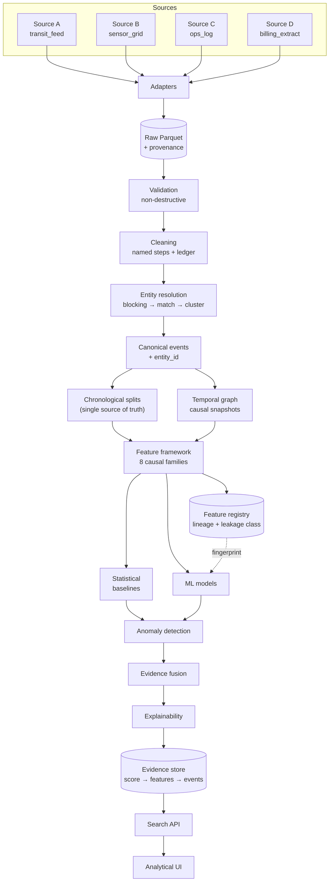
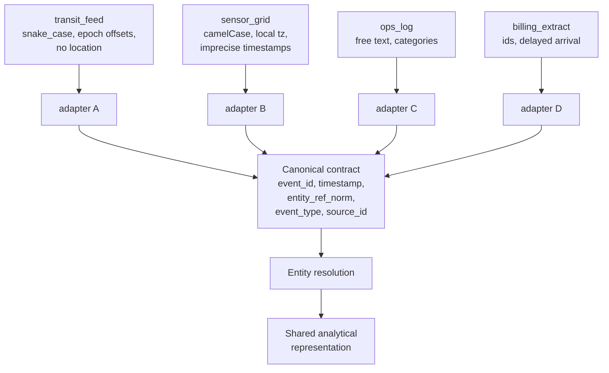
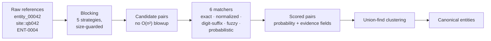
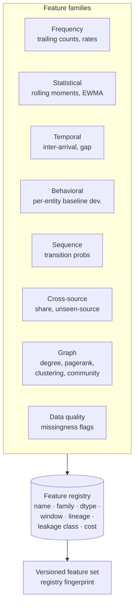
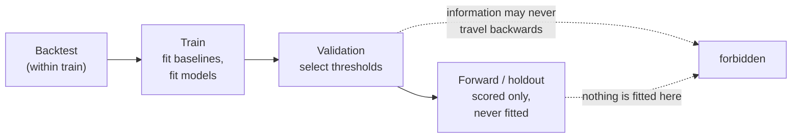
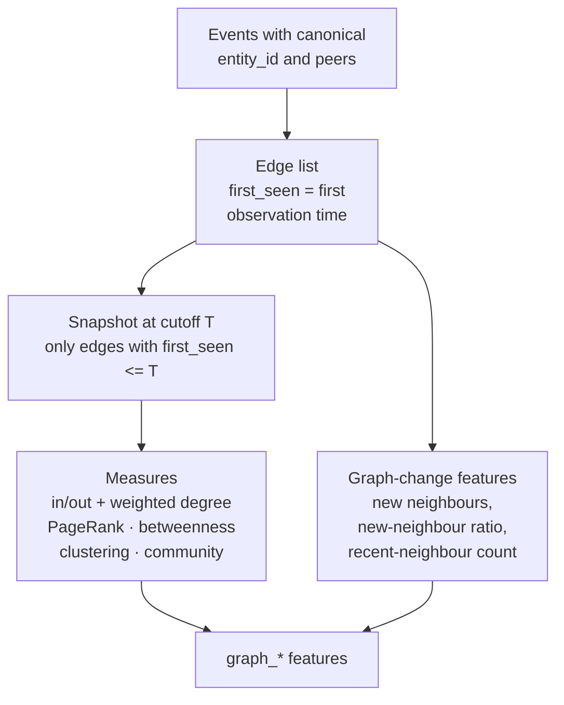

# MOSAIC

**Multi-Source Analytics, Signal & Intelligence Core**

How effectively can heterogeneous multi-source event data be integrated into a
unified analytical representation for detecting meaningful temporal, relational,
and behavioral anomalies while controlling false positives and preserving
rigorous out-of-time evaluation?

> **Status: partially implemented.** The data layer, entity resolution, feature
> framework, and temporal graph are implemented, executed, and tested. Detectors,
> evidence fusion, the search API, the frontend, and the research report are not
> built yet. This README separates *what MOSAIC is designed to investigate*, *what
> has been implemented*, and *what has actually been experimentally verified* —
> and never turns the first two into the third.

---

## At a glance

| | |
|---|---|
| **What it is** | A Data Science research platform for multi-source event integration, entity resolution, causal feature construction, temporal graph analysis, and anomaly detection |
| **Research problem** | Integrating heterogeneous sources well enough that anomalies detected on the integrated view are not artifacts of the integration |
| **Why it's hard** | Every source disagrees about schema, coverage, timing, granularity, and reliability; integration introduces its own errors (mis-resolved entities, imputed values, forward-looking features) that look exactly like signal |
| **Data** | 4 synthetic sources with deliberately incompatible schemas, 10 anomaly families, plus a truth sidecar; public datasets planned |
| **Methods** | Statistical baselines, temporal/graph feature families, ML models, multi-evidence fusion, chronological out-of-time evaluation |
| **Experimental dimensions** | Source count, feature family, entity-resolution quality, missing sources, anomaly type, time period, precision budget |
| **Reproducibility** | Fixed seeds, chronological splits from one module, leakage guards that raise rather than warn, tests in CI |

**Implemented and verified so far:**

| Component | State | Evidence |
|---|---|---|
| Synthetic generator (4 incompatible schemas, 10 anomaly families) | implemented | written + run |
| Ingestion, manifests, validation | implemented | 0 FAIL, quality 0.95 |
| Cleaning with drop ledger | implemented | deterministic, counted |
| Entity resolution (5 blocking strategies, 6 matchers) | implemented | P=0.996, R=0.997 vs truth |
| Chronological splits + leakage guards | implemented | guard tests pass |
| Feature framework (8 causal families) | implemented | 1.16 s / 498k rows; `assert_causal` passes |
| Temporal graph features | implemented | 26.6 s / 498k rows; 19 leakage tests pass |
| Detectors, fusion, calibration | **not implemented** | — |
| Search API, frontend, report | **not implemented** | — |

---

## 1. Research question

**Primary.** How effectively can heterogeneous multi-source event data be
integrated into a unified analytical representation for detecting meaningful
temporal, relational, and behavioral anomalies while controlling false positives
and preserving rigorous out-of-time evaluation?

**Secondary.** Which data sources, feature families, and model families contribute
the most signal; how stable is performance across time periods; how well
calibrated are anomaly scores; how does entity-resolution error propagate
downstream; how does the system scale with event volume.

Neither question changed during the project. The full list of secondary questions
and the experiment each maps to is in
[§ Research questions and their experiments](#14-research-questions-and-their-experiments).

## 2. Why I chose this question

I have two other technical projects. [DriftGuard](https://github.com/TMStroo/driftguard)
works on cybersecurity, network anomaly detection, distribution shift, temporal ML
evaluation, and adaptation. [ORION](https://github.com/TMStroo/ORION---Operational-Resource-Intelligence-Optimization-Network)
works on mathematical optimization, constraint programming, simulation, and
decision systems.

Between them, a layer was missing. Both of those projects begin from data that is
*already clean, already resolved, and already time-ordered*. That assumption is a
convenience, not a fact: real analytical systems receive events from several
sources, each with its own schema, coverage, noise, missingness, timing, and
granularity, and someone has to integrate them before any of the downstream
machinery works.

MOSAIC is deliberately built on that layer. It does not attempt to beat DriftGuard
at drift detection or ORION at scheduling, and it makes no such claim. The three
projects investigate different technical layers:

```
                 ┌──────────────────────────────────────────┐
                 │  MOSAIC — integration & representation    │
                 │  multi-source data engineering, entity    │
                 │  resolution, causal features, temporal    │
                 │  graphs, evidence fusion, search          │
                 └──────────────────────────────────────────┘
                    ▲                              ▲
                    │ consumes clean,               │ consumes
                    │ resolved, time-ordered data  │ representations
   ┌────────────────┴──────────┐      ┌────────────┴────────────────┐
   │ DriftGuard — temporal ML  │      │ ORION — optimization &     │
   │ evaluation under drift    │      │ decision systems           │
   └───────────────────────────┘      └─────────────────────────────┘
```

The three are complementary layers of one stack, not competing systems.

## 3. Research motivation

Modern analytical systems often receive information from several heterogeneous
sources. Those sources differ in schema, coverage, reliability, noise,
missingness, timing, and granularity. Before any statistical or ML analysis is
possible, that information must be integrated without destroying provenance and
without introducing leakage.

That is a hard Data Science problem for four reinforcing reasons.

**Integration is lossy by construction.** To combine sources you must choose a
canonical representation, and every choice discards something. Unifying
timestamps requires choosing an origin and a resolution. Unifying identifiers
requires deciding what "the same entity" means when one source calls it
`entity_00042`, another `site::qb042`, and a third has mangled it into
`ENT-0004`. The canonicalization step is a modelling decision, and its errors
propagate into every downstream number.

**The errors mimic the signal.** If an entity is resolved into two clusters, its
activity is split and both halves look anomalous. If a timestamp is coerced
imperceptibly, order is disturbed. If a missing value is imputed from the future,
the model learns something that will not recur. A pipeline that *looks* clean can
manufacture anomalies, and a pipeline that manufactures anomalies looks
convincingly successful until someone checks.

**Sources genuinely disagree.** Two sources observing the same reality can
disagree about whether an event happened, when, and how severe it was. That
disagreement is informative, not necessarily an error — but it means "multi-source"
is not automatically "more evidence."

**Anomaly detection is evaluated on what you keep.** A detector that alerts on 5%
of events and is never checked against a truth sidecar has not been evaluated.
Controlling false positives is not a reporting detail; it is most of the
difficulty.

Training a model on one clean pre-integrated table is the wrong way to study this
problem, because it assumes away the integration step entirely. If the research
question is *about* integration, then integration errors, resolution quality, and
temporal construction must be variables that can be measured and ablated — not
constants that were resolved before the experiment began.

### Why this is a Data Science research problem

The concepts involved are established, and the gap MOSAIC targets is specific.

- **Record linkage** is the canonical formulation of deciding whether two records
  describe the same real-world entity. Fellegi and Sunter (1969) derive match
  likelihood ratios from comparison agreement and disagreement; MOSAIC's matcher
  interface follows that shape — every matcher returns a probability and names the
  evidence fields that produced it.
- **Entity resolution at scale** is dominated by candidate generation, not
  comparison: comparing all pairs is quadratic, so blocking decides which pairs are
  even considered. Getting blocking wrong silently destroys recall regardless of how
  good the matchers are, which is why MOSAIC measures blocking recall separately
  from end-to-end precision and recall.
- **Practical matcher selection** is studied by Bilenko et al. (2003), who compare
  string-similarity metrics for name matching rather than assuming one — the same
  reasoning behind MOSAIC scoring six independent matchers against each other
  instead of trusting one.
- **Relational evidence across types** is the focus of Bhattacharya and Getoor
  (2005), whose treatment of clustering for multi-type resolution is the reason
  MOSAIC's graph is built from resolved entities rather than raw strings.
- **Concept drift** is what makes out-of-time evaluation mandatory rather than
  conservative. Gama et al. (2014) survey the problem and its adaptation strategies
  in detail; the point MOSAIC inherits is that a model fitted on one period meets a
  different distribution in operation.
- **Data matching** as a discipline — canonicalisation, duplicate detection, error
  propagation — is surveyed by Christen (2012), which is the closest existing
  treatment to what MOSAIC attempts to operationalize.

The literature establishes that each ingredient is a real, studied problem. What
MOSAIC is designed to investigate is whether combining them under one out-of-time
protocol produces a measurable, honest picture of what integration is worth — and
what it costs in false positives.

## 4. Origin of the research question

The question was reached by following the dependency chain, not by starting from
it:

```
heterogeneous multi-source event data
  → cannot be analyzed reliably without integration
    → integration introduces uncertainty and possible leakage
      → entity resolution and temporal context affect downstream models
        → relational information may carry signal not present in single records
          → multiple evidence sources may improve detection
            → central question
```

The central question:

> How effectively can heterogeneous multi-source event data be integrated into a
> unified analytical representation for detecting meaningful temporal, relational,
> and behavioral anomalies while controlling false positives and preserving
> rigorous out-of-time evaluation?

Every clause is load-bearing:

**"heterogeneous multi-source event data."** *Heterogeneous* means the sources do
not share a schema, a naming convention, a time reference, or a completeness
guarantee. *Multi-source* means more than one source observes overlapping
reality. Both matter because a different schema and observation process per source
is what makes integration a modelling problem rather than a concatenation.

**"integrated into a unified analytical representation."** Integration means
placing events from different sources into one frame where they can be compared.
Preserving raw data matters because every integration decision is reversible only
if the raw record survives. Provenance matters because a result that cannot be
traced to its source records cannot be defended. Canonicalization matters because
features must be computed on a consistent schema. Entity resolution matters
because an "entity's behaviour" is undefined until the records describing that
entity have been identified as belonging to it.

**"temporal."** Future observations create leakage whenever a feature or baseline
uses information from after the event being scored. Rolling and historical
features must therefore be causal by construction, not by convention — which is why
MOSAIC computes trailing windows from cumulative counts over the sorted stream
rather than from a window function evaluated on the whole column.

**"relational."** Graph structure carries information that individual records do
not: an event may be unremarkable in isolation but structurally odd for the entity
that produced it. Graph snapshots must respect time for the same reason temporal
features do — a relationship observed in the future cannot inform a historical
measurement.

**"behavioral anomalies."** An entity's deviation from *its own* history can matter
when the observation is unremarkable globally. This is why behavioral baselines are
fitted per entity on training data only.

**"controlling false positives."** Precision and false-positive rate are first-class
because an anomaly detector is judged operationally on how many alerts a human must
triage. An anomaly score is not automatically a probability: scores must be
calibrated before they are read as one.

**"rigorous out-of-time evaluation."** A chronological forward period is stronger
than a random split here because random splits mix future information into training
rows and therefore measure a capability the system will not have in operation.

## 5. Research hypotheses

Directional, and defensible without experiments. **None is confirmed.** Each is
listed so the eventual result — including a negative one — has somewhere to go.

- **H1.** Multi-source representations carry information that equivalent
  single-source representations lack, where sources contain complementary signal.
- **H2.** Temporal features improve detection of contextual and behavioral
  anomalies over static features.
- **H3.** Relational features carry signal for relational anomalies that
  independent event features cannot represent.
- **H4.** Entity-resolution error propagates downstream: higher matching error
  degrades anomaly detection.
- **H5.** Missing or degraded source coverage produces measurable changes in
  performance and feature stability.
- **H6.** Combining multiple evidence types improves robustness in some settings,
  but can *increase* false positives when poorly calibrated.

## 6. System architecture



Stages shown as detectors, fusion, API and UI are **not yet implemented**.

## 7. Research workflow


## 8. Multi-source integration



The four native schemas are deliberately incompatible. Each adapter's `normalize`
is the only place that knows its source's conventions, and a single shared
vocabulary module owns the canonical↔native category mapping so the renderer and
the adapters cannot drift apart.

## 9. Entity resolution



Measured against the generator's truth sidecar: **504 clusters for 500 true
entities, precision 0.996, recall 0.997.**

Two results are worth stating because they are negative or diagnostic:

- The **exact** and **fuzzy-similarity** matchers score 0.000. This is correct
  baseline behaviour: the sources are deliberately corrupted, so an exact string
  match is *supposed* to fail. They are controls, not contenders.
- The **probabilistic** matcher is the weakest at recall 0.492 used alone. This is
  recorded as a negative result and deliberately not tuned away.

## 10. Feature engineering



Every feature carries a **leakage class**: `CAUSAL` (uses only rows at or before
`t`), `FITTED` (uses an artifact fitted on training data only), or `FORBIDDEN`.
The registry fingerprint is recorded by every model so a result can always be
traced to the exact feature definitions that produced it.

The causal guarantee is enforced, not documented. `assert_causal` independently
recomputes trailing counts from the raw event stream with a naive per-row filter and
compares against the vectorised implementation over 2,000 spread-sampled rows. It
passes.

## 11. Temporal leakage model



`experiments/protocol.py` is the single source of every split. Fitted artifacts
carry a `FittedOn` stamp and **raise `LeakageError`** if applied to a period
earlier than the one they were fitted on — the guard is an exception, not a
warning.

The graph layer obeys the same rule. An edge is stored with the timestamp it was
*first seen*; a snapshot at cutoff `T` contains only edges with `first_seen <= T`.
The adversarial test adds five future edges and asserts that earlier degree and
clustering values are bit-identical and the PageRank ranking is unchanged.

## 12. Graph methodology



Measures: in/out and weighted degree, PageRank, betweenness centrality, clustering
coefficient, and community assignment. Betweenness is computed on a subset of
buckets by default because it is the dominant cost.

**A finding, not a bug.** In the current world `graph_new_neighbor_ratio` is 0.049
on the train period and 0.00008 on the forward period — a ~600× collapse. The
relationship graph saturates almost immediately, so "this entity just gained a new
neighbour" has almost no variance later in the timeline. This is exactly the kind of
non-stationarity a temporal graph feature set has to report rather than hide, and it
constrains which graph features are worth computing at all.

## 13. Evidence lineage


The intended property is that any anomaly can be walked backwards to the source
records that produced it, and forwards to the experiment that measured it. The
detector and explanation layers that would consume this are not implemented yet.

## 14. Research questions and their experiments

Every question is bound to an experiment family. This table is what keeps the
README connected to the actual research; rows marked **planned** have no artifact
yet.

| Research question | Experiment family | Metric | Artifact |
|---|---|---|---|
| Is ER itself accurate? | ER evaluation | blocking recall, P/R, threshold sweep | **done — P=0.996, R=0.997** |
| Does multi-source data help vs single source? | source-count ablation | PR-AUC, F1, FPR at fixed precision | planned (M8) |
| Which feature families carry signal? | per-family ablation | ΔPR-AUC vs feature subset | planned (M8) |
| How much value do temporal features add? | temporal ablation | ΔPR-AUC | planned (M8) |
| How much value do graph features add? | graph ablation | ΔPR-AUC, forward metrics | planned (M8) |
| Does entity-resolution quality matter? | ER-noise injection | downstream PR-AUC vs ER P/R | planned (M9) |
| Do statistical + ML detectors combine well? | detector fusion | PR-AUC, FPR at budget | planned (M9) |
| Which model families suit which anomalies? | model × anomaly-type grid | per-family PR-AUC | planned (M9) |
| Are results stable across time? | rolling origins | metric variance across folds | planned (M9) |
| How well calibrated are scores? | reliability analysis | Brier score, ECE | planned (M9) |
| How does missing source data affect performance? | source-outage experiment | degradation vs outage | planned (M10) |
| Does evidence stay traceable? | lineage completeness check | % anomalies with full chain | planned (M10) |
| How does it scale? | scaling benchmark | runtime, memory, throughput | planned (M10) |

## 15. Experimental design

Every experiment obtains its splits from `experiments/protocol.py` and nothing else.
The protocol defines:

- **Chronological periods** derived from the observed time span, never from the row
  count, so a period means the same thing regardless of event density.
- **Rolling origins** for stability analysis, with train / validation / forward
  windows per origin.
- **Fitted-artifact guards** that raise on backward application.
- **`assert_no_forward_rows`** to assert no evaluation row precedes its training
  data.

Random train/test splitting is not used as a primary evaluation method anywhere in
this project.

## 16. Current results

Only measurements actually executed are listed. These are **implementation results
on synthetic data**, not findings about the world.

**Data layer** (`world_a`): 497,994 cleaned events, 1,017 resolved entities, 4
sources. Validation: **0 FAIL**, quality score 0.95. Declared missingness (3–12% by
field) survives cleaning as null rather than being imputed.

**Entity resolution:** blocking recall 0.924; 504 clusters for 500 true entities;
precision 0.996, recall 0.997. Probabilistic matcher alone: recall 0.492 (negative
result, retained).

**Feature pipeline** (`include_graph=False`): **1.16 s for 497,994 rows**, all
expected columns present, `assert_causal` passes against an independent brute-force
recomputation over 2,000 spread-sampled rows. Per-family timings are recorded by
the pipeline's instrumentation.

**Graph pipeline:** **26.6 s for 498k rows**. All ten graph measures are active and
vary by period:

| Measure | Train period | Forward period |
|---|---|---|
| `graph_degree` | 1.647 | 1.933 |
| `graph_pagerank` | 0.153 | 0.158 |
| `graph_clustering` | 0.035 | 0.041 |
| `graph_community` | 86.4 | 76.1 |
| `graph_new_neighbors` | 0.470 | 0.473 |
| `graph_new_neighbor_ratio` | 0.049 | 0.00008 |

**Tests:** 33 passing — 14 temporal-feature leakage tests and 19 temporal-graph
leakage tests, including an adversarial test that adds future edges and asserts
historical features do not move.

## 17. Current limitations

Stated plainly, because a limitations section that only lists unimplemented
features is not a limitations section.

- **The results are on synthetic data.** They measure that the pipeline is
  internally correct and causally safe. They are not evidence about any real domain.
- **Entity-resolution quality is measured against a synthetic truth sidecar.** A
  generator knows the answer it planted; real data does not.
- **Graph peer resolution is not yet part of the main pipeline.** Canonicalising
  relationship endpoints currently happens in a development script. Until it moves
  into entity resolution proper, the graph is not reproducible from the pipeline
  alone.
- **Graph cost is disproportionate.** ~25 s of the ~26.6 s is relational, against
  ~1.16 s for every other feature family combined — a ~23× cost for measures that
  are still unproven useful.
- **`graph_new_neighbor_ratio` collapses ~600×** between train and forward periods.
  Saturation makes the feature near-useless late in a timeline, and no amount of
  tuning fixes that.
- **No scaling measurement.** 10M rows is untested; the graph layer's cost is
  superlinear in practice.
- **Type checking is incomplete.** `src/mosaic/graph` is clean under mypy;
  `experiments/protocol.py` still reports ~171 errors, largely from Polars stub
  `Any`-unions rather than real defects, but unreviewed.
- **No detectors have been run.** Nothing here says anything about anomaly detection
  performance, because that layer does not exist yet.
- **The four sources are synthetic.** Schema diversity is real in form but generated
  by one program, so it cannot represent the long tail of real-world schema
  incompatibility.

## 18. Reproducibility

```bash
git clone https://github.com/TMStroo/MOSAIC.git
cd MOSAIC
uv venv --python 3.12 .venv          # or: python -m venv .venv
uv pip install -e . --python .venv/Scripts/python.exe
```

Every stage records provenance: git SHA, platform, Python version, and library
versions are captured into run metadata, and feature sets carry a registry
fingerprint.

```bash
# The CLI is declared in pyproject.toml but the `mosaic.cli.main` module does not
# exist yet — the scripts below are the real entry points today.
.venv/Scripts/python.exe scratch/build_resolved.py --force
.venv/Scripts/python.exe scratch/smoke_features.py
.venv/Scripts/python.exe scratch/smoke_graph.py

# Tests and static analysis
.venv/Scripts/python.exe -m pytest tests/ -q
.venv/Scripts/python.exe -m ruff check src tests
.venv/Scripts/python.exe -m mypy src/mosaic/graph
```

## 19. Repository structure

```
src/mosaic/
  ingestion/         adapters, pipeline, registry
    synthetic/       generator, world, render, vocabulary, builder
  validation/        checks, validators, quality
  cleaning/          deterministic cleaning + drop ledger
  schema/            canonical contract, deterministic ids
  entity_resolution/ blocking, matchers, clustering, evaluation
  experiments/       protocol: chronological splits, leakage guards
  features/          registry (contracts), compute (causal families)
  graph/             temporal graph, snapshots, causal measures
  settings/ utils/   config, logging, io, timing, provenance
tests/
  leakage/           temporal-feature and temporal-graph leakage tests
scratch/             development smoke-test scripts (gitignored)
```

## 20. Research roadmap

| Milestone | Content | State |
|---|---|---|
| M1–M3 | Foundation, generator, ingestion, validation, cleaning, entity resolution | done |
| M4–M5 | Chronological protocol, causal feature framework, temporal graph | done |
| M6 | Statistical anomaly detectors and baselines | next |
| M7 | ML models, calibration, explainability | planned |
| M8 | Ablations: source count, feature family | planned |
| M9 | Robustness: ER noise, source outage, rolling stability | planned |
| M10 | Search API, analytical UI, research report | planned |

## 21. References

Citations below were checked against Crossref metadata and each supports the
specific claim it follows.

- Fellegi, I. P., & Sunter, A. B. (1969). A Theory for Record Linkage.
  *Journal of the American Statistical Association*, 64(327).
  [doi:10.1080/01621459.1969.10501049](https://doi.org/10.1080/01621459.1969.10501049)
- Bilenko, R., Mooney, R., Cohen, W., Ravikumar, P., & Fienberg, M. (2003). Adaptive
  name matching in information integration. *IEEE Intelligent Systems*, 18(9).
  [doi:10.1109/MIS.2003.1234765](https://doi.org/10.1109/MIS.2003.1234765)
- Bhattacharya, I., & Getoor, G. (2005). Relational clustering for multi-type entity
  resolution. *Proc. 4th Intl. Workshop on Multi-Relational Mining (MRDM'05)*.
  [doi:10.1145/1090193.1090195](https://doi.org/10.1145/1090193.1090195)
- Christen, P. (2012). *Data Matching: Concepts and Techniques for Record Linkage,
  Entity Resolution, and Duplicate Detection*. Springer.
  [doi:10.1007/978-3-642-31164-2](https://doi.org/10.1007/978-3-642-31164-2)
- Gama, J., Žliobaitė, I., Bifet, A., Pechenizkiy, M., & Bouchachia, A. (2014).
  A survey on concept drift adaptation. *ACM Computing Surveys*, 46(3).
  [doi:10.1145/2523813](https://doi.org/10.1145/2523813)

## License

See `LICENSE`.

This project does not claim to have introduced a new method. The research question,
the protocol, and the experiment design are this project's formulation; the
literature above motivated the problem.